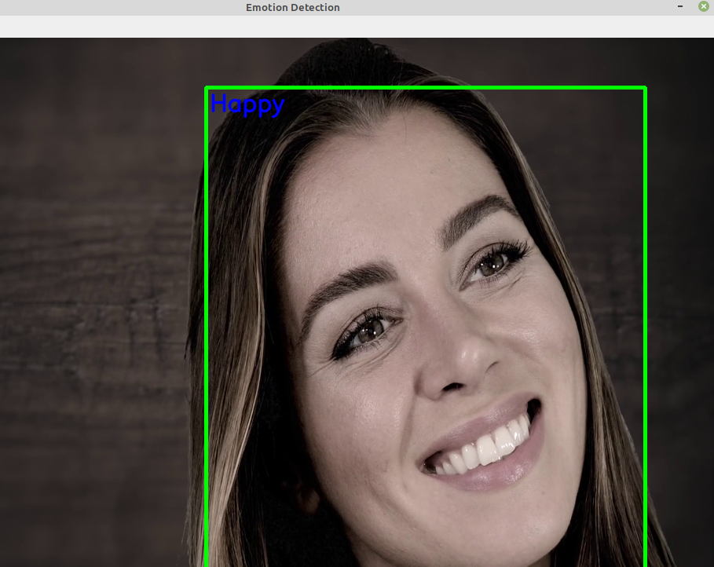

# EMOTION DETECTION 👋 




🛠️ Emotion Detection or Facial Expression Classification is a widely researched topic in today’s Deep Learning arena. To classify your emotions in real-time using just you camera and some lines of code is actually a big step towards Advanced Human Computer interaction.

### 👉 PACKAGES NEED TO BE INSTALLED 

- pip install numpy
- pip install opencv-python
- pip install keras


### 👉 RUN YOUR EMOTION DETECTION FILE

``` python3 TestEmotionDetector.py ```
